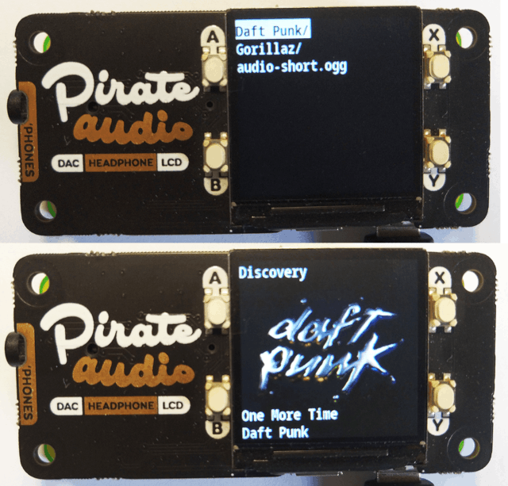

# PiratePlayer
While there are other good software for audio playing, none of them works fully offline (mopidy) or doesn't natively support GPIO buttons (omxplayer): PiratePlayer to the rescue!

# HOW-TO use
while browsing menu:
>press A to scroll up  
>press B to scroll down  
>press X to select current file  
>press Y to go back  

while playing:
>press A to stop and go back to menu  
>press B to decrease volume  
>press X to play//pause  
>press Y to increase volume  

## Hardware needs
- Raspberry pi, a cheap model like the zero-w works fine
- Pimoroni's pirate-audio hat, or hack together some DIY
- (optional) 3.7v LiPo + 5v regulator or something like a LiPo shim

## Install deps
Install requirements for [gstreamer](https://gstreamer.freedesktop.org/documentation/installing/on-linux.html) and [hifiberry dac](https://www.hifiberry.com/docs/software/configuring-linux-3-18-x)

then make sure you have installed:
>gobject-introspection libgirepository1.0-dev libcairo2-dev

## Setup dev environment
PiratePlayer runs with python >= 3.5

>$ virtualenv venv  
>$ . venv/bin/activate  
>$ pip3 install --editable .  
>$ pirateplayer

## Install as systemd service (from python module)
install pirateplayer from pip  
launch install.sh
